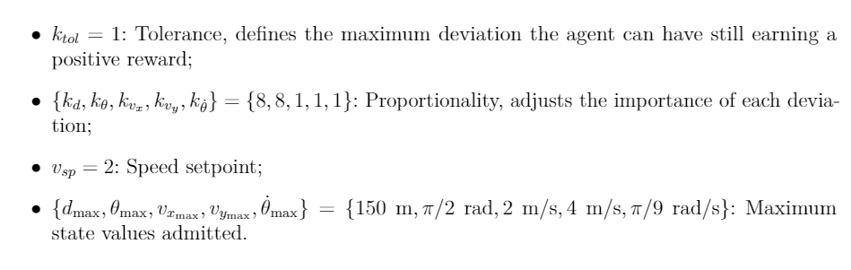

## Entrega Intermediária do Projeto Final
#### Por Victor Vergara

### Caso 1 - Navegador de Navios em canais

Hoje em dia a navegação por canais estreitos é feita por um profissional especializado nesse tipo de navegação em um canal específico (corrente marítima, velocidade do vento etc), como no canal do panamá ou canal de Suez, e mesmo assim podem ocorrer erros que podem ter grandes impactos na economia global, como foi o caso no canal de Suez em 2021.

Um aluno de engenharia desenvolveu um ambiente no gym Open AI como parte de seu TCC, onde ele montou a mecânica do ambiente, os estados, sistema de rewards etc. Segue o link:

https://towardsdatascience.com/openai-gym-from-scratch-619e39af121f

O agente tem o objetivo de atravessar o canal passando pelo seu centro (o mais longe das bordas).
O agente utiliza 5 variáveis: Velocidade no eixo X, Velocidade no eixo Y, a distância do centro do navio até a sua guia, o ângulo com a sua guia e a sua velocidade angular.

As recompensas seguem a fórmula abaixo:

Também é possível alterar as recompensas do ambiente na função calculate_reward no arquivo ship_env.py

Já existem alguns AIs para navagação autônoma de navios, como o MAS da IBM, o Maritime AI da WindWard e o Orca AI, mas não são focados para navegações em canais estreitos, que demanda um treinamento longo e específico. Assim o uso de ensinamento por reforço pode ser uma solução interessante para esse uso, mas vale ressaltar que provavelmente seria necessário um treinamento para cada canal, visto que é necessário uma precisão muito alta pela pequena margem de erro e a grande diferença entre os ambientes dos diferentes canais.

### Caso 2 - Sugestão de compras baseado no carrinho de compras 

Muitas empresas utilizam AIs para sugerir itens  baseados no carrinho de compras de seus clientes o gym-shopping-cart utiliza o aprendizado por reforço para fazer isso.Segue o link para o projeto deles:

https://gitlab.com/WinderAI/rl/gym-shopping-cart

Ele utiliza um dataset da Instacart que contém mais de 3 milhões de compras de seus clientes, com os dados dos produtos e quem comprou.
Segue o link para o data set:

https://www.kaggle.com/competitions/instacart-market-basket-analysis/overview

O objetico do agente é sugerir produtos que os usuários comprariam baseado no seu carrinho de compras atual, sendo essa a sua única ação.

As recompensas são definas na função _reward no arquivo shopping_cart_v0.py, sendo +1 para produtos adicionados corretamente e -1 para produtos adiciondos incorretamente

Como foi dito anteriormente existem modelos de recomendações de compras que funcionam bem, como o da Amazon, que utilizam modelos de aprendizado de máquina supervisionado utilizando muitos dados, que para empresas pequenas e novas pode ser uma dificuldade, assim o aprendizado por reforço pode ser uma boa alternativa.

### Caso 3 - Sugestão de anúncios para o usuário

Hoje em dia varios sites e empresas dependem de anúncios para se sustentar, assim para valorizar mais os anúncios e terem uma melhor acertividade, algumas empresas como o Google e a Meta montaram sistemas para achar os melhores usuários para os seus anúncios.

O reco-gym é um ambiente montado utilizando o Open AI Gym para recomendação de propaganda utilizando reinforcement learning, mas também pode ser utilizado para outros tipos de recomendações. Segue o link do projeto:

https://github.com/criteo-research/reco-gym/blob/master/Getting%20Started.ipynb

No caso de recomendações de anúncios o agente observa o comportamento do usuário e recomenda algo recebendo uma reward baseado se o user clicou na recomendação ou não, tendo como objetivo ter o máximo de suas recomendações clicadas pelo usuário. Recomendar é a única ação que o agente pode fazer.

Os rewards do ambiente são definidas na classe evolutionCase no arquivo constants.py que é utilizado na função evaluate_agent no arquivo evaluate_agent.py para definir as rewards.

Como dito anteriormente muitas empresas utilizam outros métodos para criar um sistema de recomendação, como clusterização e outros aprendizados de máquina supervisionado que funcianam muito bem, mas precisam de muitos dados para o seu treinamento. Assim um aprendizado via reforço pode ser interessante para empresas pequenas que não tem acesso a grandes dados para construir os seus modelos.

## Caso Escolhido - Caso 1 - Navegador de Navios em canais

O caso escolhido foi o navegador de Navios em canais, visto que é um trabalho necessário para a economia mundial que depende de algumas pessoas especializadas na área, demandando muito treinamento, e não há um AI para isso. 
Para a implementação será utilizado o ambiente mostrado no Caso 1.
