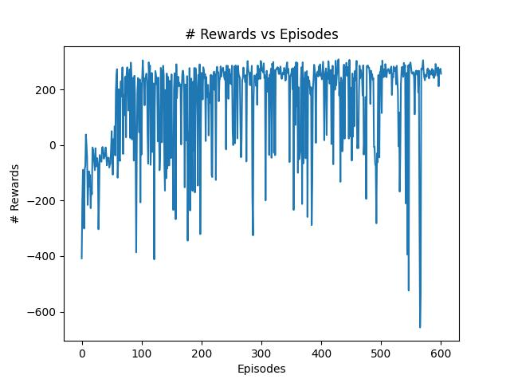
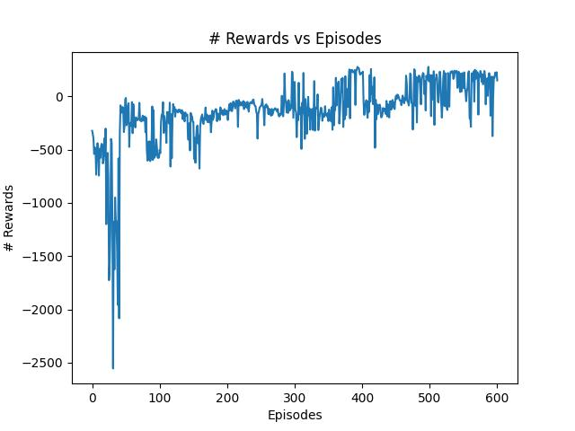
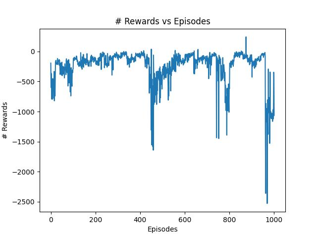
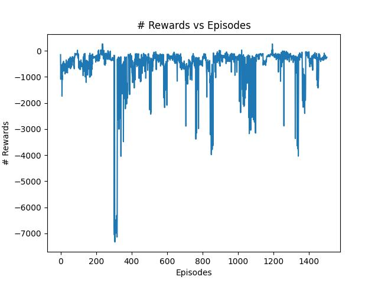
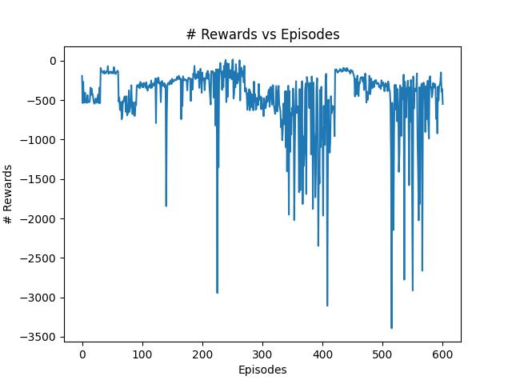

# Relatório LunarLander

### Victor Vergara

# DeepQLearning: 

### Algoritmo: DeepQLearning.py

### Treinar: LunarLander.py

### Rodar Modelo: trainedLunarLander.py

O Algoritmo DeepQLearning é uma versão do algotirmo QLearning que utiliza uma rede neural ao invés de uma QTable para armazenar os seus resultados de aprendizado.

## Modelo treinado:

Foi treinado um modelo com 600 episódios com 3000 ações máximas para cada episódio, utilizando um gamma = 0,99 e um epsilon inicial de 1, que é reduzido 1% a cada ação até 0,01.

Após o treinamento foi criado o modelo não compilado model_lunar_land que obtém uma pontuação média de 260 pontos, sempre pousando corretamente dentro do espaço designado (entre as bandeiras amarelas).
 

Analisando o gráfico acima pode-se perceber que o modelo uma melhora no aprendizado crescente ao longo dos primeiros episódios, tendo um crescimento incial, mas depois segue um padrão piorar e melhor ao longo do treinamento.

# DoubleDeepQLearning: 

### Algoritmo: DoubleDeepQLearningV2.py

### Treinar: DoubleLunarLander.py

### Rodar Modelo: trainedDoubleLunarLander.py

O Algoritmo DoubleDeepQLearning é uma versão do algotirmo DeepQLearning que utiliza 2 redes neurais, uma que é atualizada a cada ação (como a do DeepQLearning) e a segunda é atualizada a quantidade de episódios escolhidos. O uso da segunda rede neural é para evitar a supervalorização dos resultados, evitando a grande variação da pontuação obtida entre episódios.

## Modelo treinado:

Foi treinados 3 modelos com 600, 1000 e 1500 episódios com 3000 ações máximas para cada episódio e atualizando a segunda rede neural a cada 20 episódios, utilizando um gamma = 0,99 e um epsilon inicial de 1, que é reduzido 1% a cada ação até 0,01 (mesmo valores que o modelo DeepQLearning)

Após o treinamento foram criados 3 modelo não compilados:

model_double_lunar_land  (600 episódios) que obtém uma pontuação média de 160 pontos (variando entre 260 e 40 pontos), sempre pousando corretamente, mas fora do espaço designado e gastando tempo tentando se estabelizar após o pouso.

model_double1000_lunar_land (1000 episódios) que obtém uma pontuação média de -380 pontos, demorando muito tempo para pousar e na maioria das vezes passando do limite de 3000 ações e não pousando no local designado

model_double1500_lunar_land (1500 episódios) que obtém uma pontuação média de -180 pontos, sendo muito mais ágil que os outros modelos para pousar, mas tem dificuldades em manter estabilização horizontal, saindo do ambiente ou pousando torto.
 

Segue os gráficos dos 3 modelos em ordem:

Analisando os gráficos acima pode-se perceber que o modelo uma melhora no aprendizado crescente ao longo dos primeiros episódios, tendo um crescimento incial, mas depois segue um padrão piorar e melhor ao longo do treinamento. Mas tem menos quedas e subidas bruscas em relação ao modelo inicial.

Por isso foi feito um quarto modelo igual aos anteriores, mas atualizando a segunda rede neural a cada 30 episódios a fim de checar se a segunda rede neural for atualizada menos vezes obteria-se um resultado melhor:

model_double600V2_lunar_land (600 episódios) que obtém uma pontuação média de -400 pontos, não conseguindo nem pousar nem se manter estável no ar.

Segue os gráficos do último modelo:

Esse modelo apresenta mais quedas que os outros que utilizam DoubleDeepQLearning e nunca se obteve um resultado positivo ao longo do seu treinamento, isso mostra a importância da escolha de quando que a segunda rede neural deve ser atualizada.

